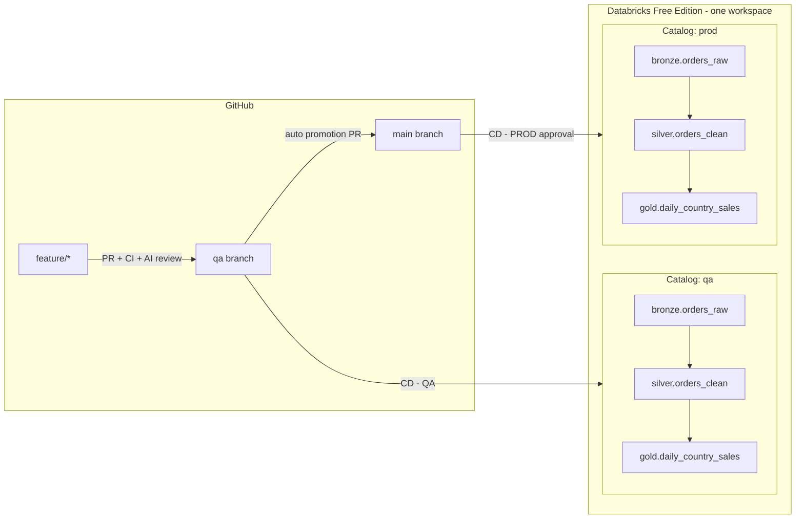

# RTB C16 — Databricks ETL CI/CD with GitHub Actions + GenAI

A production-shaped, end-to-end reference implementation for the DevOps RTB C16
case study: a **medallion ETL pipeline on Databricks Free Edition**, deployed by
**GitHub Actions** to two environments (**QA** and **PROD**) isolated by Unity
Catalog, with **GenAI** embedded in the pipeline and a **SonarQube** quality gate.

---

## 1. What this project delivers

| Case-study requirement | Where it lives |
| --- | --- |
| Databricks ETL / job deployment via CLI | [databricks.yml](databricks.yml), [resources/retail_etl_job.yml](resources/retail_etl_job.yml) |
| CI: build, lint, test | [.github/workflows/ci.yml](.github/workflows/ci.yml) |
| CD: QA then PROD | [.github/workflows/cd-qa.yml](.github/workflows/cd-qa.yml), [.github/workflows/cd-prod.yml](.github/workflows/cd-prod.yml) |
| Modular / reusable pipeline | [.github/workflows/reusable-deploy.yml](.github/workflows/reusable-deploy.yml), [.github/actions](.github/actions) |
| GenAI: PR review | [scripts/genai/review_pr.py](scripts/genai/review_pr.py) |
| GenAI: workflow YAML validation | [scripts/genai/validate_workflows.py](scripts/genai/validate_workflows.py) |
| GenAI: log summarisation / deploy report | [scripts/genai/deployment_report.py](scripts/genai/deployment_report.py) |
| GenAI: release notes / changelog | [scripts/genai/release_notes.py](scripts/genai/release_notes.py) |
| GitHub Secrets + env protection | [docs/SECRETS.md](docs/SECRETS.md) |
| Security scanning (SAST, deps, secrets) | `security` job in [ci.yml](.github/workflows/ci.yml) |
| Notifications | `notify` job in [cd-prod.yml](.github/workflows/cd-prod.yml) |
| Branching strategy | [docs/BRANCHING_STRATEGY.md](docs/BRANCHING_STRATEGY.md) |
| Unit + integration tests | [tests/](tests) |
| SonarQube | [sonar-project.properties](sonar-project.properties), [docs/SONARQUBE_SETUP.md](docs/SONARQUBE_SETUP.md) |

---

## 2. Architecture



The **same wheel, same job definition and same code** are deployed to both
environments. The only difference is the bundle target, which swaps the Unity
Catalog name and the data-quality strictness (`conf/qa.yml` vs `conf/prod.yml`).

### Databricks Free Edition constraints honoured

- **Serverless compute only** — the job uses an `environments:` block, never `new_cluster`.
- **One workspace** — QA/PROD isolation is by **catalog**, plus bundle `root_path`
  and a job `name_prefix`, so the two deployments never collide.
- **PAT authentication** — no service principals required.

---

## 3. Repository layout

```
.github/
  actions/setup-python-env/     composite: Python + Java + pip cache
  actions/databricks-cli/       composite: pinned CLI + auth check
  workflows/ci.yml              lint, security, test+Sonar, bundle validate
  workflows/ai-pr-review.yml    advisory GenAI review on PRs
  workflows/reusable-deploy.yml single modular deploy implementation
  workflows/cd-qa.yml           qa branch  -> qa catalog
  workflows/cd-prod.yml         main branch-> prod catalog (+ release notes)
  CODEOWNERS, pull_request_template.md
src/retail_etl/
  config.py       environment resolution (qa|prod) + table naming
  schemas.py      explicit bronze contract
  transforms.py   pure, unit-testable DataFrame logic
  quality.py      data-quality gate (strict in prod, advisory in qa)
  storage.py      all Unity Catalog I/O
  pipeline.py     bronze/silver/gold entry points (console scripts)
  conf/qa.yml, conf/prod.yml   shipped inside the wheel
resources/        Databricks Asset Bundle job definitions
notebooks/        one-time environment bootstrap notebook
scripts/genai/    GenAI helpers (fail-soft, provider-agnostic)
tests/unit/       fast local-Spark tests (run in CI)
tests/integration/post-deployment smoke tests (run after deploy)
docs/             branching strategy, secrets, SonarQube guide
```

---

## 4. Quick start

### 4.1 Prerequisites
- Python 3.11, Java 17 (PySpark needs a JVM), Git
- A Databricks **Free Edition** workspace
- The Databricks CLI ≥ 0.230

### 4.2 Local development

```bash
git clone <your-repo> && cd rtb-c16-databricks-cicd
python -m venv .venv && .venv\Scripts\activate      # PowerShell: .venv\Scripts\Activate.ps1
pip install -r requirements-dev.txt
pip install -e .

pytest                       # unit tests only (integration auto-skipped)
ruff check src scripts tests
black --check src scripts tests
python scripts/genai/validate_workflows.py
```

### 4.3 One-time Databricks setup

1. In the workspace, create a PAT: **avatar → Settings → Developer → Access tokens**.
2. Authenticate the CLI locally:
   ```bash
   databricks configure --host https://<your-workspace>.cloud.databricks.com --token
   ```
3. Create the catalogs and seed data for both environments:
   ```bash
   databricks bundle deploy --target qa
   databricks bundle run retail_etl_bootstrap --target qa

   databricks bundle deploy --target prod
   databricks bundle run retail_etl_bootstrap --target prod
   ```
4. Run the pipeline once by hand to confirm:
   ```bash
   databricks bundle run retail_etl_job --target qa
   ```

### 4.4 GitHub setup

1. Create the `qa` and `main` branches (`main` is the default).
2. Add secrets and variables — see [docs/SECRETS.md](docs/SECRETS.md).
3. Create the `qa` and `prod` **Environments** with protection rules —
   see [docs/BRANCHING_STRATEGY.md](docs/BRANCHING_STRATEGY.md).
4. Add the branch protection rulesets listed in the same document.
5. Optional: set up SonarQube — see [docs/SONARQUBE_SETUP.md](docs/SONARQUBE_SETUP.md).
6. Edit `.github/CODEOWNERS` and replace `@your-github-handle`.

---

## 5. The pipeline

| Layer | Table | Logic |
| --- | --- | --- |
| Bronze | `<catalog>.bronze.orders_raw` | Raw CSV read with an explicit schema + `_ingested_at`, `_source_file`, `_batch_id` audit columns |
| Silver | `<catalog>.silver.orders_clean` | Trim/normalise, reject blank keys and non-positive qty/price, dedupe on `order_id` keeping the latest, derive `gross_amount` and `order_date`; partitioned by `order_date` |
| Gold | `<catalog>.gold.daily_country_sales` | Orders, customers, revenue and AOV per country per day |

The silver task runs a **data-quality gate**:

| | QA | PROD |
| --- | --- | --- |
| Max rejection rate | 20% | 5% |
| Violation behaviour | warn | **fail the job** |

Every task emits a machine-readable `ETL_METRICS {...}` line, which the GenAI
deployment reporter parses into a metrics table — the AI narrative is built on
facts, not on guesses.

---

## 6. GenAI integration

| Step | Trigger | Output | Blocking? |
| --- | --- | --- | --- |
| AI code review | PR to `qa`/`main` | Sticky PR comment + job summary | No (advisory) |
| Workflow validation | CI + PR | Deterministic findings **(blocking)** + AI suggestions (advisory) | Partially |
| Deployment report | after every deploy | Job summary + 30-day artifact | No |
| Release notes | PROD deploy | GitHub Release body | No |

Design principles applied:
- **Fail-soft:** no API key → deterministic fallback, build still green.
- **Zero-cost path:** with no `OPENAI_API_KEY`, it uses **GitHub Models** via the
  built-in `GITHUB_TOKEN` (`permissions: models: read`).
- **Redaction:** `ai_client.redact()` masks credential-shaped strings before any
  prompt leaves the runner.
- **Human in the loop:** AI never approves, merges or gates a deployment. The PR
  template forces the author to record what AI advice they accepted or rejected.

---

## 7. Testing strategy

| Suite | Command | Runs where |
| --- | --- | --- |
| Unit (pure transforms, config, quality, GenAI helpers) | `pytest` | Every push/PR |
| Integration smoke (real Unity Catalog queries) | `pytest -m integration tests/integration` | After each deploy |

Unit tests use a local Spark session, cover the dirty-data cases explicitly
(duplicates, blanks, zero quantity, zero price, null key), assert idempotency,
and enforce **80% coverage** via `fail_under` in `pyproject.toml`.

Integration tests skip themselves cleanly when workspace credentials are absent.

---

## 8. Demo script (10 minutes)

1. Show `docs/BRANCHING_STRATEGY.md` and the protected branches.
2. `git switch -c feature/demo qa`, make a small change to `transforms.py`, push.
3. Show CI going green: lint → security → tests + Sonar gate → bundle validate.
4. Open the PR to `qa`; show the **AI review comment** appear.
5. Merge → show **CD — QA**: bundle deploy, job run, smoke tests, **AI deployment report**.
6. Show the auto-created `qa -> main` promotion PR.
7. Merge it → show **CD — PROD pausing for approval**; approve.
8. Show the prod catalog tables in Databricks, the tagged release with
   **AI release notes**, and the Teams notification.
9. Show the SonarQube project page: coverage, gate status, new-code metrics.

---

## 9. Operations

**Rollback**
```bash
git revert <commit> && git push          # redeploys the previous code
# or restore data only:
# RESTORE TABLE prod.gold.daily_country_sales TO VERSION AS OF <n>;
```

**Manual run**
```bash
databricks bundle run retail_etl_job --target prod
```

**Where to look when something fails**

| Failure | Look at |
| --- | --- |
| CI lint/test | Job logs + `test-results` artifact |
| Sonar gate | SonarQube project → New Code |
| `bundle validate` | YAML in `databricks.yml` / `resources/` |
| `bundle deploy` | PAT expiry, workspace URL, UC permissions |
| Job run | AI deployment report artifact → `ETL_METRICS` table |
| Smoke tests | `DATABRICKS_WAREHOUSE_ID` secret, catalog contents |

---

## 10. Known limitations

- Free Edition has no service principals or OIDC, so a PAT is used; rotate it.
- Free Edition has no multi-workspace isolation, so QA and PROD share a workspace
  and are separated by catalog only. In a paid tier, point the `prod` GitHub
  Environment at a different `DATABRICKS_HOST` — **no code change is required**.
- Sonar's Community Edition does not analyse PR branches; use SonarQube Cloud for that.
