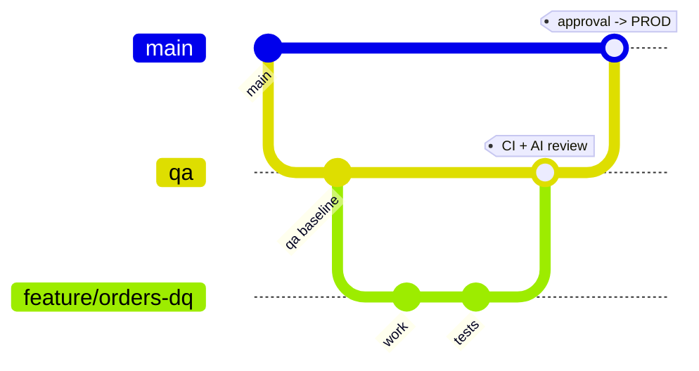

# Branching Strategy & Environment Promotion



## Branches

| Branch | Protected | Purpose | Deploys to |
| --- | --- | --- | --- |
| `feature/*`, `bugfix/*` | no | Day-to-day development | nothing (CI only) |
| `qa` | yes | Integration branch, always deployable | Unity Catalog **`qa`** |
| `main` | yes | Production truth | Unity Catalog **`prod`** |
| `hotfix/*` | no | Emergency fix branched from `main` | `prod` after approval, then back-merged to `qa` |

## Flow

1. `git switch -c feature/ABC-123-short-description qa`
2. Push → **CI** runs: ruff, black, yamllint, bandit, pip-audit, gitleaks,
   pytest + coverage, SonarQube gate, `databricks bundle validate` for both targets.
3. Open a PR into `qa` → the **AI PR Assistant** posts an advisory review comment.
4. Merge (squash) → **CD — QA** deploys the bundle to the `qa` catalog, runs the job,
   runs integration smoke tests and publishes an AI deployment report.
   It then opens/updates a `qa -> main` promotion PR automatically.
5. Review the promotion PR → merge → **CD — PROD** waits for the `prod` GitHub
   Environment approval, deploys to the `prod` catalog, tags a release and
   publishes AI-generated release notes, then sends a Teams/Slack notification.

## Branch protection rules to configure

**Settings → Branches → Add ruleset** (apply to `qa` and `main`):

- Require a pull request before merging — 1 approval, dismiss stale approvals
- Require review from Code Owners (`.github/CODEOWNERS`)
- Require status checks to pass:
  - `Lint & static analysis`
  - `Security scanning`
  - `Unit tests & coverage`
  - `Validate Databricks bundle (qa)`
  - `Validate Databricks bundle (prod)`
- Require branches to be up to date before merging
- Require conversation resolution
- Block force pushes and deletions
- (on `main`) Require signed commits — optional but recommended

## Environments

**Settings → Environments**

| Environment | Protection | Secrets |
| --- | --- | --- |
| `qa` | Deployment branch rule: `qa` only | inherited from the repository |
| `prod` | Required reviewers (1+), wait timer 5 min, deployment branch rule: `main` only | inherited; override `DATABRICKS_*` here once you have a second workspace |

Because Databricks Free Edition gives you a single workspace, the `qa` and `prod`
environments may point at the **same host** — isolation is achieved by the
Unity Catalog name (`qa` vs `prod`) plus the bundle target and job name prefix.

## Hotfix procedure

```bash
git switch -c hotfix/ABC-999 main
# fix + test
gh pr create --base main
# after merge and prod deploy:
git switch qa && git merge main && git push   # keep qa in sync
```
